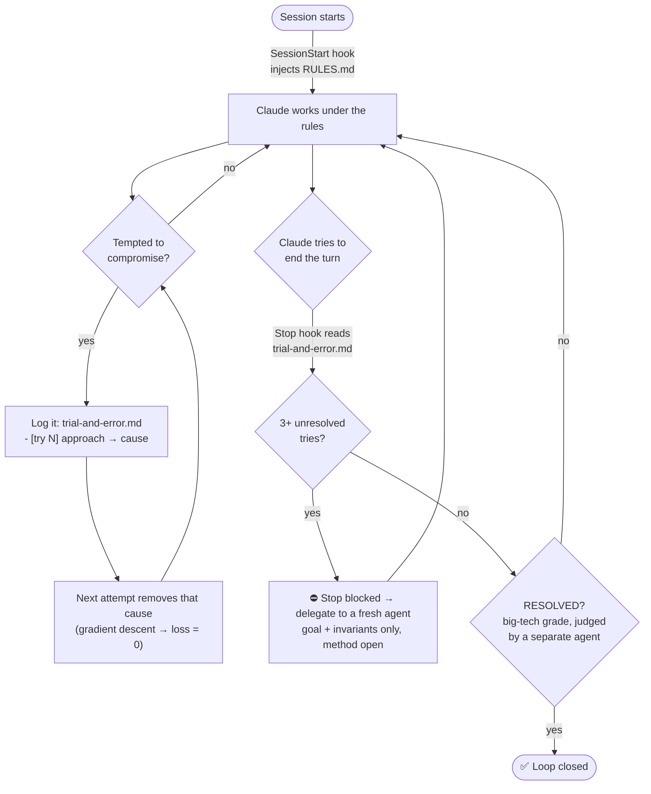

# Loss-Zero

**Don't let Claude stop at "good enough."** A discipline harness that makes Claude Code **finish what it starts** — instead of declaring victory early, drifting off-goal, or quietly compromising.

It ships as a Claude Code **plugin**: always-on working rules plus a `Stop` hook that won't let a half-solved problem be called "done." The name is the goal — drive every task to **loss = 0**.

[](https://github.com/juyoung020/claude-loss-zero)


> ⚡ **One `Stop` hook and a rules file** — no framework, no bloat, no telemetry.

## What it looks like

*Illustrative — the moment the `Stop` hook refuses a premature "done":*

```console
You ▸ refactor the auth module and make the whole suite pass

Claude ▸ (3 approaches tried, each logged to trial-and-error.md)
         The token-refresh mock still fails. I'll note it as a known
         limitation and wrap up here.

  ⛔ Stop hook ▸ trial-and-error log has 3 failed attempts and no
     resolution marker. Stop self-overestimating and DELEGATE now —
     goal + invariants only, method open. "RESOLVED" counts only if an
     Anthropic-grade review, run by a separate agent, would pass it.

Claude ▸ Understood — handing it to a fresh agent with just the goal…
         Independent agent found a refresh race; fix applied, suite green.
         ✅ RESOLVED (verified by an independent review pass)
```

Without the hook, that turn ends at "known limitation." With it, the loop closes.

---

## Install

**Requirements:** Claude Code, and **Node.js** on your `PATH` (the hooks are plain Node, zero dependencies — Windows, macOS, Linux).

```bash
# 1. Add this repo as a plugin marketplace
/plugin marketplace add juyoung020/claude-loss-zero

# 2. Install the plugin
/plugin install loss-zero@loss-zero
```

Restart Claude Code (or `/reload-plugins`) and you're done — the rules load every session and the `Stop` hook is live. Update later with `/plugin marketplace update loss-zero`.

<details>
<summary><b>Prefer no plugin? Manual install</b></summary>

1. Copy `plugins/loss-zero/scripts/` somewhere stable.
2. Add a `Stop` hook in `~/.claude/settings.json` pointing at `check_loop_closed.js`:
   ```json
   { "hooks": { "Stop": [ { "hooks": [ { "type": "command", "command": "node \"/abs/path/to/check_loop_closed.js\"" } ] } ] } }
   ```
3. Paste the contents of `RULES.md` into your `~/.claude/CLAUDE.md`.
</details>

## The problem it solves

LLMs are overconfident about themselves. In practice that shows up as:

- **"That's impossible."** — calling a big or unfamiliar task undoable, when it just needed to be split up or researched.
- **"Done!"** — declaring a job finished when it's actually half-finished or subtly wrong.
- **Drifting** — quietly swapping the original goal for an easier one ("efficient" becomes "the path of least resistance").
- **Open loops** — kicking off automation that wanders off or stops halfway, reported as complete.

The deeper pattern: **the model gates good behavior on its own judgment** — "Am I stuck? Do I need to look this up? Is this good enough?" — and that judgment is exactly what overconfidence corrupts. So it skips the research, skips the delegation, and ships the mediocre result.

## The core idea

> **Never gate good behavior on self-judgment. Make it the default, trigger it objectively, or verify it externally.**

Concretely:

| Weak (self-judged) | Strong (this harness) |
| --- | --- |
| "Do I have a knowledge gap?" → maybe skip research | **Research by default**, no gate |
| "Am I stuck enough to delegate?" → never feels stuck | **Objective count**: 3 failed attempts → delegation forced |
| "Is this good enough?" → optimistic yes | **Big-tech bar**, judged by a **separate agent** |
| "I think the loop is closed." | **Verify by running/observing** before ending |

The harness encodes this as eight always-on rules and backs the two most-skipped ones (delegation + closing the loop) with a hook that the model **cannot overconfidence its way past**, because the trigger is a number in a file, not a feeling.

## How it works



**1. Always-on rules (SessionStart hook).**
Every session, the plugin injects [`RULES.md`](plugins/loss-zero/rules/RULES.md) as context — the equivalent of a global `CLAUDE.md`, but packaged so it travels with the plugin.

**2. Trial-and-error gradient descent.**
When Claude is tempted to compromise, the rules tell it to *not* accept the compromise and instead write to `trial-and-error.md` in the working folder:

```
# Goal: <the original objective — never lowered>
- [try 1] approach A -> failed because X
- [try 2] removed X -> failed because Y
- [try 3] removed Y -> ...
```

Each attempt records its **failure cause**; the next attempt is aimed at **removing that cause** — gradient descent that drives the distance to the goal (the "loss") toward zero. No lowering the goal; you converge *to* it.

**3. The Stop hook (objective enforcement).**
When Claude tries to end its turn, [`check_loop_closed.js`](plugins/loss-zero/scripts/check_loop_closed.js) reads `trial-and-error.md`:

- **3+ `[try]` entries with no resolution marker → the stop is blocked**, and Claude is told to delegate to a fresh agent (goal + invariants only, method left open) rather than keep grinding with a polluted context.
- It exits cleanly the moment a line starting with `RESOLVED`, `DELEGATED`, or `NEEDS-USER` is present.
- It **never reads the problem's content** — it only counts an objective, domain-agnostic proxy. Any error → fail-open (your session is never broken).

**4. "Done" means big-tech grade.**
`RESOLVED` is only legitimate if a **Google / Microsoft / Anthropic-grade review** — run by an *independent* agent, not Claude's own self-assessment — would pass it. Below that bar, it's still an open task. (With a guardrail against the opposite failure: don't gold-plate or inflate the scope.)

This bar is a borrowed trick. In Stable Diffusion, appending *"masterpiece, best quality"* to a prompt visibly lifts the output — the model reaches higher simply because you anchored it higher. Loss-Zero does the same to *engineering judgment*: anchor the definition of "done" to elite work, and the default verdict flips from a hopeful **"good enough"** to a skeptical **"not yet."**

## Using it

You don't have to do anything special — the rules drive Claude. The one habit worth knowing:

- When a task gets hard and a compromise is tempting, Claude starts `trial-and-error.md` and logs `[try N]` attempts with causes.
- After 3 unresolved tries, the Stop hook forces delegation.
- The turn can only end with a `RESOLVED` / `DELEGATED` / `NEEDS-USER` marker, so loops don't silently stay open.

The log file may be named `trial-and-error.md` or `시행착오.md`; markers and `[try]`/`[시도]` work in English or Korean.

## Customize

- **Threshold:** change `THRESHOLD` in `check_loop_closed.js` (default `3`).
- **Rules:** edit `rules/RULES.md` — it's injected verbatim.
- **Markers / log name:** edit the `LOG_NAMES` and `allow` regex in the script.

## Why a hook, not just a prompt?

A prompt rule ("please don't stop early") is itself subject to the overconfidence it's trying to fix — the model reads it and still thinks it's done. The hook moves the decision **out of the model's head and into a file check**: three lines exist, or they don't. That's the whole trick — and it's why the trigger is a count, not a judgment.

## FAQ

**Does this slow down simple tasks?**
No. The log and the gate only engage when Claude is actually compromising or looping. Trivial tasks never create `trial-and-error.md`, so the hook exits instantly.

**Won't it get stuck in an infinite block loop?**
No. The block is a single nudge with a clear exit: resolve it, or mark the log `RESOLVED` / `DELEGATED` / `NEEDS-USER`. The hook also fails open on any error.

Contributions welcome — open an issue or PR.

## License

MIT
